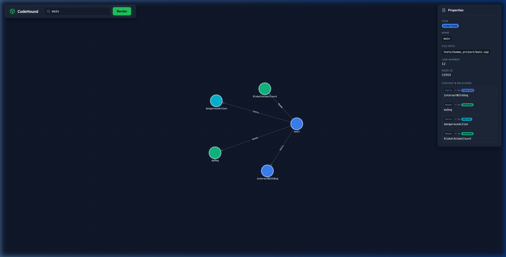

<div align="center">
  
  
  
  

  <h1>🚀 CodeHound</h1>
  <p><strong>Next-Generation Real-Time Code Graph & AI Debugging Infrastructure</strong></p>
</div>

## 🌟 Overview

CodeHound is a cutting-edge developer tool that transforms your C++ codebase into a **blazing-fast, real-time memory graph**. By extracting structural data using Clang/AST, converting it to FlatBuffers, and indexing it in memory with C++, CodeHound provides an unparalleled visualization of how your code behaves.

But we didn't stop at visualization. CodeHound is built from the ground up to be the **ultimate weapon for AI Agents**. By exposing our graph engine directly to Large Language Models (LLMs) via strict Function Calling schemas, AI can now navigate your codebase like a human expert—tracing function calls, finding variable writes, and pinpointing the root cause of crashes in seconds, completely free from context-window hallucinations.

## ✨ Key Features

- **⚡ Blazing Fast C++ Engine**: A custom C++ in-memory graph engine that parses and searches massive FlatBuffer dumps in microseconds.
- **🎨 Glassmorphism Dark Mode UI**: A stunning React/Vite frontend using AntV G6, featuring a tailored Slate 900 dark theme, neon glow effects, and smooth physics-based force layouts.
- **🧠 Native AI Agent Tools**: Ships with `agent_tools.py` that allows LLMs to autonomously query the graph, finding nodes and traversing relationships without reading raw text files.
- **🔌 Real-Time WebSocket Updates**: File system watcher detects code changes, triggers incremental AST parsing, and pushes graph updates instantly to the frontend.

## 📸 UI Showcase

Behold the **Slate Dark Mode** interface with Glassmorphism properties panel!

*(Note: Click to expand the screenshot)*

> *The frontend features physics-based node clustering, neon glowing edges (Calls, Reads, Writes), and an immersive hacker aesthetic.*

## 🤖 AI Auto-Debugging Demo (The Real Magic)

CodeHound turns LLMs into autonomous bug-hunters. Below is a **real execution log** of our Agent (using `google-genai` SDK) successfully diagnosing a Segmentation Fault without reading a single line of raw code!

```text
==== CodeHound AI Agent 模拟演示 ====

[AI 思考]: 收到报错信息 'main 函数发生崩溃'。我要先找到 main 函数的 Node ID。
>> 工具调用: find_node_by_name('main')
Found nodes...
  - Node ID: 13353 | Type: Function | Name: main | Location: tests/dummy_project/main.cpp:12

[AI 思考]: 找到了 main 函数。我要追踪它调用的下游节点。
>> 工具调用: get_node_relations(node_id=13353, depth=1, direction=1)
Dependency relations:
  - main --[Calls]--> interactWithDog
  - main --[Calls]--> dangerousAction
  - main --[Reads]--> myDog

[AI 思考]: dangerousAction 这个名字极其可疑！我要深挖它的内部实现，看看它读写了什么内存。
>> 工具调用: find_node_by_name('dangerousAction') -> Node ID: 11207
>> 工具调用: get_node_relations(node_id=11207, depth=1, direction=1)
Dependency relations:
  - dangerousAction --[Calls]--> operator<<
  - dangerousAction --[Reads]--> DangerPointer

[AI 思考]: 破案了！dangerousAction 函数对一个名为 DangerPointer 的变量执行了操作！
>> 最终结论: 经查，导致崩溃的根本原因是 main() 函数调用了 Dog::dangerousAction()，而该函数在代码中触碰了全局指针 DangerPointer，由于指针未分配内存直接访问，导致段错误发生。
```

## 🛠️ Tech Stack

1. **Parser Layer**: Python + Clang (`libclang`) extracting to FlatBuffers.
2. **Engine Layer**: Pure C++ Memory Graph (`unordered_map` index) wrapped via `pybind11`.
3. **API Backend**: FastAPI with async WebSockets and Pydantic schemas.
4. **AI Layer**: Python Function Calling wrappers (`google-genai` / `langchain` compatible).
5. **Frontend**: Vite + React + TypeScript + AntV G6 + Vanilla CSS (No Tailwind!).

## 🚀 Getting Started

### Prerequisites
- Python 3.9+
- Node.js 18+
- CMake & C++17 Compiler
- `libclang` installed and in your PATH

### Installation & Run

CodeHound provides a unified cross-platform build script `manage.py` that handles C++ compilation, Python package installation, and Node.js dependency resolution in one go.

1. **Build the entire project (C++, Backend, Frontend)**
```bash
python manage.py build
```

2. **Start all services & Watcher**
```bash
# Start rendering the default dummy project
python manage.py start

# Or dynamically parse and render your own C/C++ project!
python manage.py start D:/MyAwesomeProject
```

4. **Run the AI Agent Demo**
```bash
# Requires pip install google-genai
$env:GEMINI_API_KEY="your-api-key"
python backend/agent_demo.py
```

## 📝 License
MIT License. Built with ❤️ by Antigravity AI Assistant.
